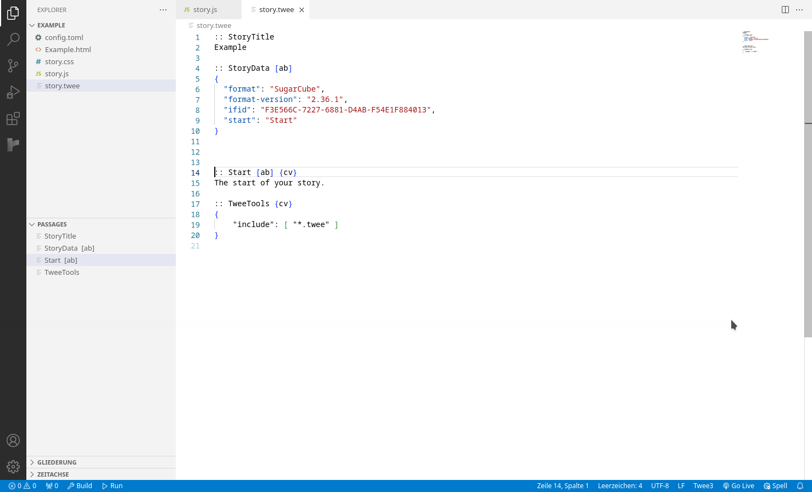
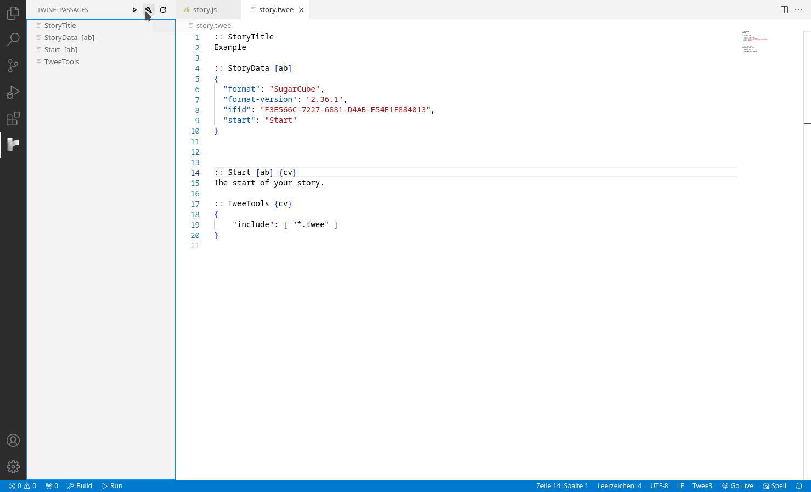
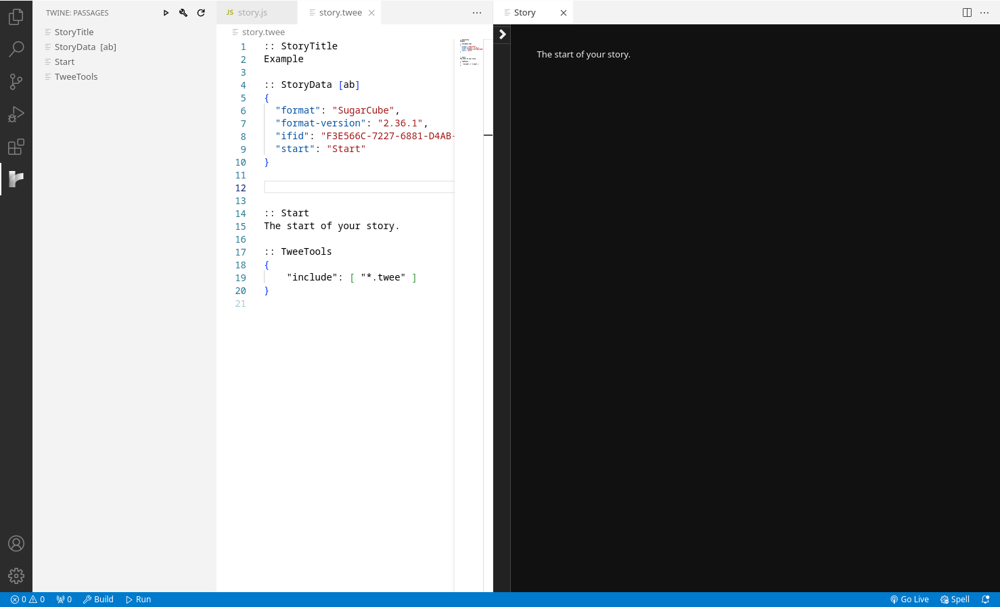

# Twine IDE

This extension lets you to build and run Twine stories in VSCode.

## Features

- Build Twine stories with the 4 default story formats supported by Twine.
- Run stories in VSCode, with automatic rebuild on save.
- Syntax highlighting for Twee files.
- Split your story up in multiple files.
- Also split up story JS and CSS.

<!-- Tip: Many popular extensions utilize animations. This is an excellent way to show off your extension! We recommend short, focused animations that are easy to follow.-->

## Requirements

This extension needs [Twine Tools](https://github.com/tareksander/twine-rs/tree/main/twee-tools#installation) to be installed.

## Getting Started

You can run `twee init <storyname> <storyformat>` in a VSCode terminal to generate example files and configuration. The extension should automatically activate when opening a Twee file.

For more information about the Twee extensions used for building, [see the Twine Tools Readme](https://github.com/tareksander/twine-rs/tree/main/twee-tools#twee-format-extensions).

## Extension Settings

Currently none.

